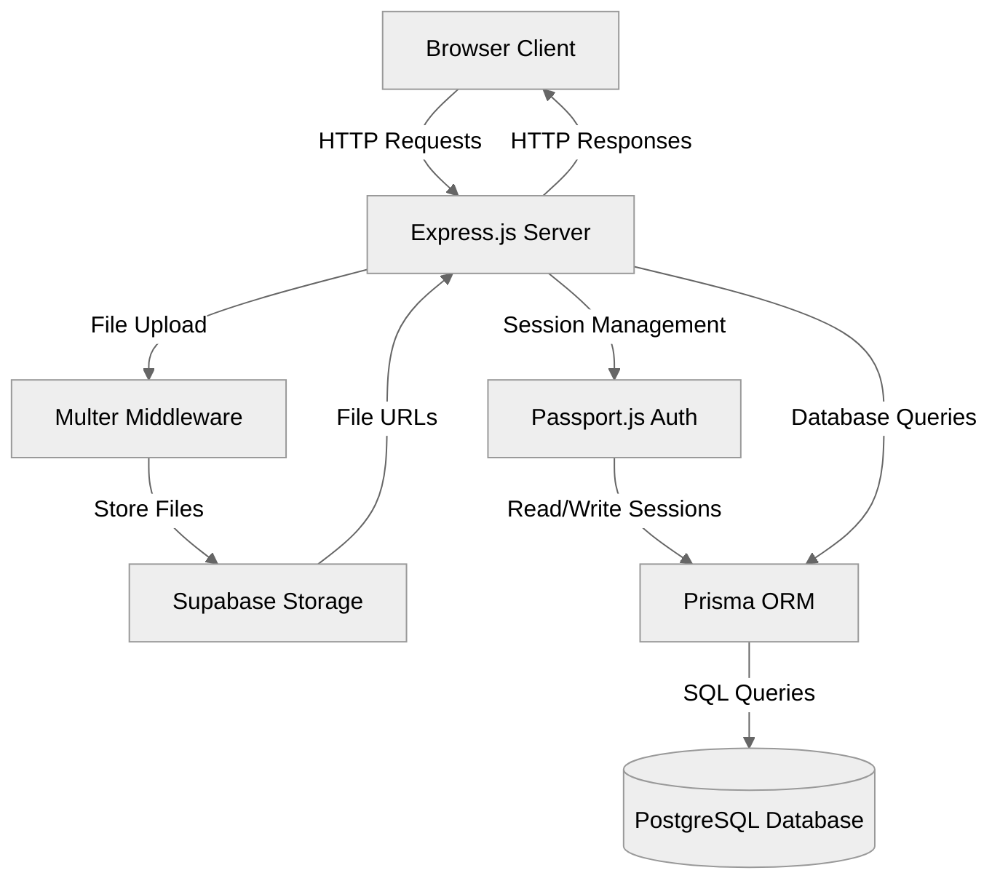

# File-Uploader

---

## Project Structure 

```bash
.
├── app.ts
├── generated
├── package-lock.json
├── package.json
├── prisma
│   ├── migrations
│   │   ├── 20260114024502_init
│   │   │   └── migration.sql
│   │   ├── 20260114080238_init
│   │   │   └── migration.sql
│   │   ├── 20260115153739_init
│   │   │   └── migration.sql
│   │   ├── 20260119131317
│   │   │   └── migration.sql
│   │   ├── 20260119144019
│   │   │   └── migration.sql
│   │   ├── 20260120054609_folders_and_files
│   │   │   └── migration.sql
│   │   └── migration_lock.toml
│   └── schema.prisma
├── prisma.config.ts
├── public
│   ├── images
│   │   ├── collaborate.svg
│   │   ├── private.svg
│   │   └── upload.svg
│   └── styles.css
├── README.md
├── script.ts
├── src
│   ├── config
│   │   ├── authenticateRoute.ts
│   │   └── passport.ts
│   ├── controllers
│   │   ├── CreateFolder
│   │   │   ├── renderCreateFolderForm.ts
│   │   │   └── sendCreateFolderForm.ts
│   │   ├── Dashboard
│   │   │   ├── renderDashboardPage.ts
│   │   │   ├── renderIndividualFile.ts
│   │   │   └── renderIndividualFolder.ts
│   │   ├── Homepage
│   │   │   └── homepage.ts
│   │   ├── Log-In
│   │   │   ├── renderLogInForm.ts
│   │   │   └── sendLogInForm.ts
│   │   ├── Log-Out
│   │   │   └── log-out.ts
│   │   └── Sign-Up
│   │       ├── renderSignUpForm.ts
│   │       └── sendSignUpForm.ts
│   ├── lib
│   │   ├── prisma.ts
│   │   └── queries.ts
│   ├── routes
│   │   ├── CreateFolder
│   │   │   └── createFolder.ts
│   │   ├── Dashboard
│   │   │   └── dashboard.ts
│   │   ├── Homepage
│   │   │   └── homepage.ts
│   │   ├── Log-In
│   │   │   └── log-in.ts
│   │   ├── Log-Out
│   │   │   └── log-out.ts
│   │   └── Sign-Up
│   │       └── sign-up.ts
│   └── views
│       ├── CreateFolder
│       │   └── createFolder.ejs
│       ├── Dashboard
│       │   └── dashboard.ejs
│       ├── Home
│       │   └── home.ejs
│       ├── Log-In
│       │   └── log-in.ejs
│       ├── partials
│       │   ├── authenticatedNavbar.ejs
│       │   ├── dashboardNavbar.ejs
│       │   ├── error.ejs
│       │   └── unauthenticatedNavbar.ejs
│       └── Sign-Up
│           └── sign-up.ejs
└── tsconfig.json

```

---
## System Architecture



---

## How to Run

1. Clone the repository:
```bash
git clone 
```

2. Install dependencies
```bash
npm install
```

3. Start Development Server:
```bash
node app.ts
```

4. Open `http://localHost:8080` in your browser

---

*Part of The Odin Project's [NodeJS Course]
([https://www.theodinproject.com/lessons/nodejs-file-uploader])*